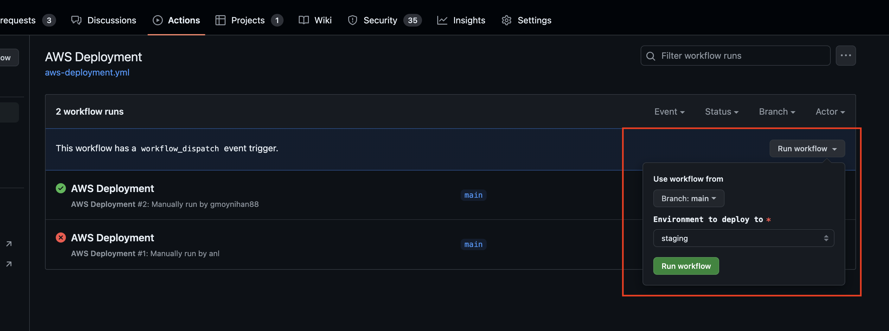
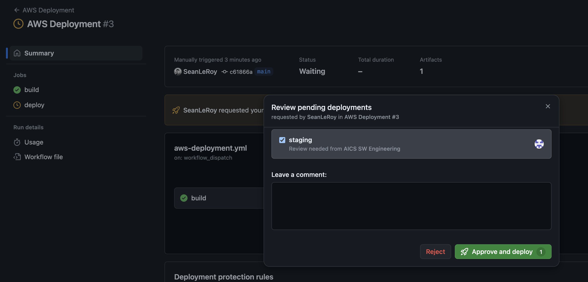

Versioning and deployment/publishing
====================================


The strategy for versioning and deployment/publishing within this project is complicated by the fact that there are two distinct
types of artifacts produced. That is, `packages/desktop` produces platform-specific executables for linux, macOS, and Windows,
while `packages/web` produces a static website intended to be dumped into an S3 website bucket (or otherwise sit
behind a web server).

# Web

1) Make sure all your changes are committed and merged into `main`.
2) Navigate to the GH workflow actions and select "Run workflow" along with the branch `main` & `staging`.
   
3) Review deploy action & approve if it looks good.
   
4) Test out changes on [staging](https://staging.biofile-finder.allencell.org/app).
5) Navigate to the GH workflow actions and select "Run workflow" along with the branch `main` & `production`.
6) Review deploy action & approve if it looks good.
7) Test out changes on [production](https://biofile-finder.allencell.org/app)

# Desktop

The following captures the steps of a release of this project to desktop:

1) Make sure all your changes are committed and merged into main.
2) Make sure branch is clean:
    ```bash
    git checkout main
    git stash
    git pull
    ```
3) Determine version bump type, choose one of `patch`, `minor`, or `major`, depending on the scale of the changes including in this version bump. This will create a version like `v<version>`. See [below for a guideline to which version to increment to](#versioning-information).
    ```bash
    # You need to choose one of 'patch', 'minor', or 'major'
    export VERSION_BUMP_TYPE=<one of patch, minor, or major>
    ```
4) Create tag and push new version to GitHub like so:
    ```bash
    npm --no-commit-hooks version --workspace packages/desktop $VERSION_BUMP_TYPE -m "v%s"
    ```
5) Wait for a [GitHub Action](https://github.com/AllenInstitute/aics-fms-file-explorer-app/actions) to automatically create new platform-specific
builds of `packages/desktop`, prepare a draft Github release, and upload the builds as release artifacts to that release.
6) [Update the GitHub release](https://github.com/AllenInstitute/aics-fms-file-explorer-app/releases) once the Github action in Step 4 is finished, manually edit the Github release which was drafted as part of Step 4. Format its release name with the date (consistent with other release names), add a description of the changes, and optionally
mark whether the release is "pre-release." If it is marked as "pre-release," it will not be accessible for download through the
Github pages site.
